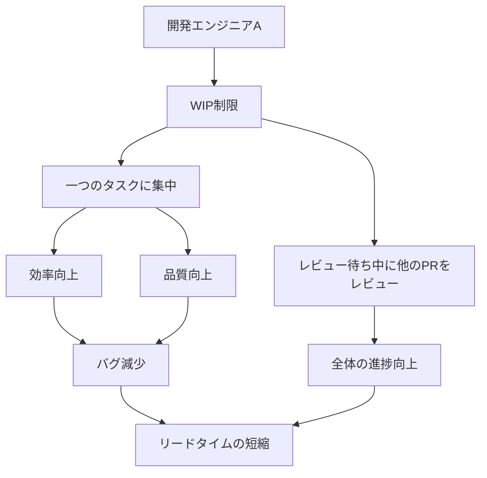
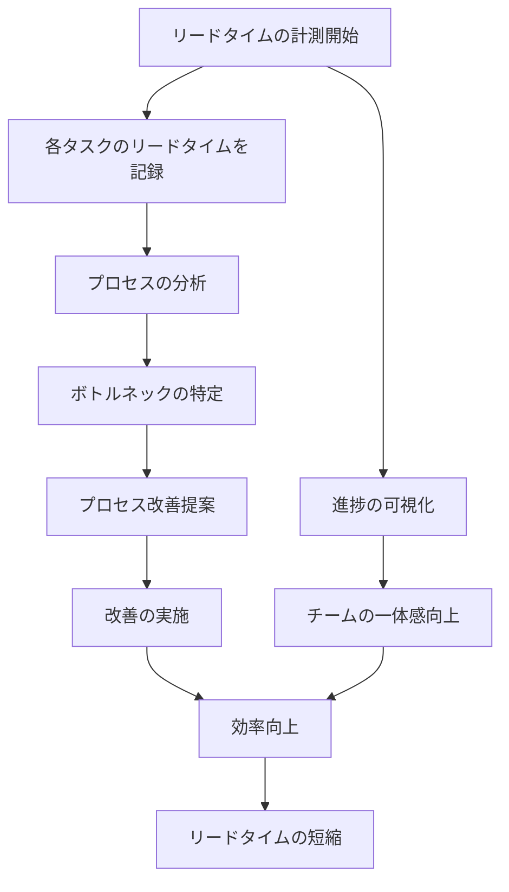

{}

## はじめに

自分が目指したい世界

```text
短い期間でPDCAを回し続けて、ゴリゴリデプロイする世界
```

## WIP制限

WIP制限をすることで開発エンジニアが一つのタスクに集中して、生産性を爆上げしたい



### 最初の一歩として行うことで、見通す今後の展望(WIP制限)

タスクアサインに関するフローが整理されると考えています。

1. タスクを完了した時に、次のタスクを取りやすい仕組みが欲しくなる
    - タスクの優先度管理の整備をする必要になる
2. 1タスクあたりの見積もりと実際の工数の計算が可能になり、一定期間においてのパフォーマンスを把握することができる
    - チームとしてのベロシティ（パフォーマンス）の計測ができる
    - プロジェクトの完了時期を予想しやすくなる
3. レビュー待ちなどの時間に、PRレビューやチームメンバーのサポートに時間を割ける
    - 貯まっているPRやDiscussionを消費して、他のメンバーの待ち時間を少なくする

## リードタイムの計測

チームのパフォーマンスを定量化して、数値をもとに改善し続けるチームにしたい



### 最初の一歩として行うことで、見通す今後の展望（リードタイムの計測）

パフォーマンスを可視化することで、より良くしようという意識づけできると考えています。

1. 多角的な視点から生産性改善のアプローチが行われる
    - 個人の生産性やチームmtgの見直しなど、幅広いアクションが行われる
2. プロセスの分析とボトルネックの改善を繰り返すことでPDCAが習慣化される
    - 改善を続けて、より良くする習慣が着く
3. 一つの目標が共有されることでチームの一体感が生まれる
    - 様々なプロジェクトが走っているが、同じ目標に対して取り組むことでチームワークが促進される

{}